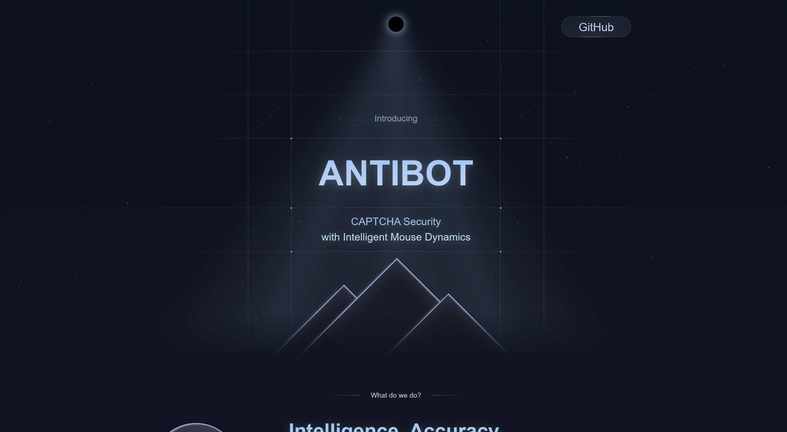

# React + Vite

This template provides a minimal setup to get React working in Vite with HMR and some ESLint rules.

Currently, two official plugins are available:

- [@vitejs/plugin-react](https://github.com/vitejs/vite-plugin-react/blob/main/packages/plugin-react/README.md) uses [Babel](https://babeljs.io/) for Fast Refresh
- [@vitejs/plugin-react-swc](https://github.com/vitejs/vite-plugin-react-swc) uses [SWC](https://swc.rs/) for Fast Refresh



# AntiBot

AntiBot is a CAPTCHA security solution that differentiates human users from automated bots using mouse dynamics data. By extracting unique features that describe lognormal parameters like stroke distance, initial time, temporal delay, impulse response time, and number of strokes, AntiBot intelligently reads user behavior. This in-depth analysis enables precise identification of authentic users in real-time, enhancing security and ensuring a trustworthy user experience by preventing unauthorized bot access.

## Table of Contents

- [Installation](#installation)
- [Usage](#usage)
- [Project Structure](#project-structure)
- [Scripts](#scripts)
- [Endpoints](#endpoints)
- [License](#license)

## Installation

1. Clone the repository:

    ```sh
    git clone url_of_repository
    cd antibot
    ```

2. Install the dependencies for the client:

    ```sh
    npm install
    ```

3. Install the dependencies for the server:

    ```sh
    cd Server
    npm install
    ```

4. Set up the environment variables: 
    Create a .env file in the Server directory with the following content:

    ```sh
    PORT=port number
    DIR_PATH=path for a directory
    ```

## Usage

Start the server:

```sh
cd Server
npm run dev
```

Start the client:

```sh
cd ..
npm run dev
```
## Endpoints

### POST /save-csv

Saves the mouse movement data as a CSV file and processes it using a Python script.

**Request Body:**

```json
{
    "data": [
        { "x": 1008, "y": 211, "timestamp": 1730839112657, "button": "NoButton", "state": "Move" },
        ...
    ]
}
```

**Response:**

- `200 OK`: File saved and processed successfully.
- `500 Internal Server Error`: An error occurred while saving or processing the file.

### GET /read-result

Reads the result from the `result.txt` file and returns it.

**Response:**

- `200 OK`: The content of the `result.txt` file.
- `500 Internal Server Error`: An error occurred while reading the file.

